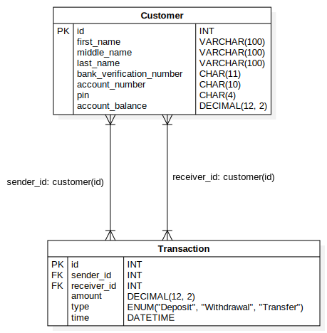

# Demo Credit API

This application is a backend API for a hypothetical mobile lending app called Demo Credit.
As such the API implements some of the basic functionalities:
- Account creation
- Depositing
- Withdrawal
- Transfers between user accounts

The live version of the API is available at Heroku on https://osas-solo-demo-credit-api.herokuapp.com/

You can also test the API on Postman at https://www.postman.com/osas-solo/workspace/demo-credit-live/collection/27573825-f0850987-3aec-4cc4-8283-8bfbe95e21e8?action=share&creator=27573825

## Database Schema

```
        Entity Relationship Diagram
```

The database consists of 2 tables - _customers_ and _transactions_. The _transactions_ table is related to the 
_customers_ table by the _sender_id_ and _receiver_id_ columns which are foreign keys that reference the _id_ column of
the _customers_ table

## Technologies Used
- Node JS
- Express JS
- Typescript
- MySQL

## Getting Started
### Prerequisites
- Node JS
- MySQL
##
### Installation
- Download or clone the repository
- On your local MySQL server, import the `demo_credit_db.sql` file located at the root of the downloaded folder
- Navigate to the project directory on the terminal
- Run `npm install` to install the dependencies
- After the dependencies have been installed, create a `.env` file in the root directory of the project and copy the
contents of the `.env.example` file into it
- Run `npm run dev` to start the development server
- The server should be running on `http://localhost:3000`

# API Documentation

## Create Account
### Request
`POST /api/customers`

| Parameter                | Description                                                                                                       |
|:-------------------------|:------------------------------------------------------------------------------------------------------------------|
| `firstName`              | **Required**. Customer's first name. It can only contain letters and can only accept a maximum of 100 characters  |
| `middleName`             | **Optional**. Customer's middle name. It can only contain letters and can only accept a maximum of 100 characters |
| `lastName`               | **Required**. Customer's last name. It can only contain letters and can only accept a maximum of 100 characters   |
| `bankVerificationNumber` | **Required**. Customer's BVN. It can only contain 11 digits                                                       |
| `pin`                    | **Required**. Customer's pin to be used during transactions. It can only contain 4 digits                         |

### Response
```json
{
    "status": 201,
    "message": "Account Creation Success",
    "data": {
        "firstName": "Osaremhen",
        "middleName": "",
        "lastName": "Ukpebor",
        "bankVerificationNumber": "12345678901",
        "pin": "1234",
        "accountNumber": "1695011087"
    }
}
```
```json
{
    "status": 401,
    "message": "Account Creation Failure",
    "error": {
        "firstNameError": "Sorry, first names can only contain letters and cannot exceed 100 characters",
        "middleNameError": "Sorry, middle names can only contain letters and cannot exceed 100 characters",
        "lastNameError": "Sorry, last names can only contain letters and cannot exceed 100 characters",
        "bankVerificationNumberError": "Sorry, Bank Verification Numbers (BVNs) can only contain 11 digits",
        "pinError": "Sorry, pins can only contain 4 digits"
    }
}
```


## Retrieve All Customers
### Request
`GET /api/customers`

### Response
```json
{
    "status": 200,
    "message": "OK",
    "data": [
        {
            "firstName": "John",
            "middleName": "",
            "lastName": "Doe",
            "accountNumber": "1112222288"
        },
        {
            "firstName": "Osaremhen",
            "middleName": "Solomon",
            "lastName": "Ukpebor",
            "accountNumber": "3311490310"
        },
        {
            "firstName": "Osaremhen",
            "middleName": "",
            "lastName": "Ukpebor",
            "accountNumber": "0696003656"
        },
        {
            "firstName": "Osaremhen",
            "middleName": "",
            "lastName": "Ukpebor",
            "accountNumber": "1695011087"
        }
    ]
}
```


## Retrieve Individual Customer
### Request
`GET /api/customers/:accountNumber`

### Response
```json
{
    "status": 200,
    "message": "Customer Profile",
    "data": {
        "firstName": "Osaremhen",
        "middleName": "Solomon",
        "lastName": "Ukpebor",
        "accountNumber": "3311490310",
        "accountBalance": 2000
    }
}
```
```json
{
    "status": 404,
    "message": "Customer Not Found",
    "error": "No customer with the account number 1111111111 could be found"
}
```


## Deposit
### Request
`POST /api/transactions/deposit`

| Parameter       | Description                                                                                                       |
|:----------------|:------------------------------------------------------------------------------------------------------------------|
| `accountNumber` | **Required**. Customer's account number. It can only contain 10 digits                                            |
| `amount`        | **Required**. Amount to be deposited. It must begin with a non-zero digit, can only be denoted with 2 decimal places and must not exceed 5 million      |
| `pin`           | **Required**. Customer's pin. It can only contain 4 digits                         |

### Response
```json
{
    "status": 200,
    "message": "Deposit Success",
    "data": {
        "transaction": {
            "sender": {
                "id": 2,
                "firstName": "Osaremhen",
                "middleName": "Solomon",
                "lastName": "Ukpebor",
                "accountNumber": "3311490310"
            },
            "receiver": {
                "id": 2,
                "firstName": "Osaremhen",
                "middleName": "Solomon",
                "lastName": "Ukpebor",
                "accountNumber": "3311490310"
            },
            "amount": 5000,
            "type": "Deposit"
        },
        "accountBalance": 7000
    }
}
```
```json
{
    "status": 401,
    "message": "Deposit Failure",
    "error": "Sorry, the pin you entered is incorrect"
}
```
```json
{
    "status": 404,
    "message": "Deposit Failure",
    "error": "No customer with the account number 1111111111 could be found"
}
```
```json
{
    "status": 401,
    "message": "Deposit Failure",
    "error": {
        "accountNumberError": "Sorry, account numbers must contain 10 digits",
        "pinError": "Sorry, pins must contain 4 digits",
        "amountError": "Sorry, amount must begin with a non-zero digit, can only be denoted with 2 decimal places and must not exceed 5 million"
    }
}
```


## Withdrawal
### Request
`POST /api/transactions/withdraw`

| Parameter       | Description                                                                                                  |
|:----------------|:-------------------------------------------------------------------------------------------------------------|
| `accountNumber` | **Required**. Customer's account number. It can only contain 10 digits                                       |
| `amount`        | **Required**. Amount to be withdrawn.  It must begin with a non-zero digit, can only be denoted with 2 decimal places and must not exceed 5 million      |
| `pin`           | **Required**. Customer's pin. It can only contain 4 digits                         |

### Response
```json
{
    "status": 200,
    "message": "Withdrawal Success",
    "data": {
        "transaction": {
            "sender": {
                "id": 2,
                "firstName": "Osaremhen",
                "middleName": "Solomon",
                "lastName": "Ukpebor",
                "accountNumber": "3311490310"
            },
            "receiver": {
                "id": 2,
                "firstName": "Osaremhen",
                "middleName": "Solomon",
                "lastName": "Ukpebor",
                "accountNumber": "3311490310"
            },
            "amount": 2000,
            "type": "Withdrawal"
        },
        "accountBalance": 5000
    }
}
```
```json
{
    "status": 401,
    "message": "Withdrawal Failure",
    "error": "Sorry, you do not have enough funds to make this withdrawal"
}
```
```json
{
    "status": 401,
    "message": "Withdrawal Failure",
    "error": "Sorry, the pin you entered is incorrect"
}
```
```json
{
    "status": 401,
    "message": "Withdrawal Failure",
    "error": {
        "accountNumberError": "Sorry, account numbers must contain 10 digits",
        "pinError": "Sorry, pins must contain 4 digits",
        "amountError": "Sorry, amount must begin with a non-zero digit, can only be denoted with 2 decimal places and must not exceed 5 million"
    }
}
```
```json
{
    "status": 401,
    "message": "Withdrawal Failure",
    "error": "Sorry, the pin you entered is incorrect"
}
```
```json
{
    "status": 404,
    "message": "Withdrawal Failure",
    "error": "No customer with the account number 1111111111 could be found"
}
```


## Transfer
### Request
`POST /api/transactions/transfer/:senderAccountNumber`

| Parameter       | Description                                                                                                                                           |
|:----------------|:------------------------------------------------------------------------------------------------------------------------------------------------------|
| `accountNumber` | **Required**. Receiver's account number. It can only contain 10 digits                                                                                |
| `amount`        | **Required**. Amount to be transferred.  It must begin with a non-zero digit, can only be denoted with 2 decimal places and must not exceed 5 million |
| `pin`           | **Required**. Sender's pin. It can only contain 4 digits                                                                                              |

### Response
```json
{
    "status": 200,
    "message": "Transfer Success",
    "data": {
        "transaction": {
            "sender": {
                "id": 2,
                "firstName": "Osaremhen",
                "middleName": "Solomon",
                "lastName": "Ukpebor",
                "accountNumber": "3311490310"
            },
            "receiver": {
                "id": 1,
                "firstName": "John",
                "middleName": "",
                "lastName": "Doe",
                "accountNumber": "1112222288"
            },
            "amount": 1000,
            "type": "Transfer"
        },
        "accountBalance": 4000
    }
}
```
```json
{
    "status": 401,
    "message": "Transfer Failure",
    "error": "Sorry, you do not have enough funds to make this withdrawal"
}
```
```json
{
    "status": 401,
    "message": "Transfer Failure",
    "error": "Sorry, your account number or pin might be incorrect"
}
```
```json
{
    "status": 401,
    "message": "Transfer Failure",
    "error": {
        "accountNumberError": "Sorry, account numbers must contain 10 digits",
        "pinError": "Sorry, pins must contain 4 digits",
        "amountError": "Sorry, amount must begin with a non-zero digit, can only be denoted with 2 decimal places and must not exceed 5 million"
    }
}
```